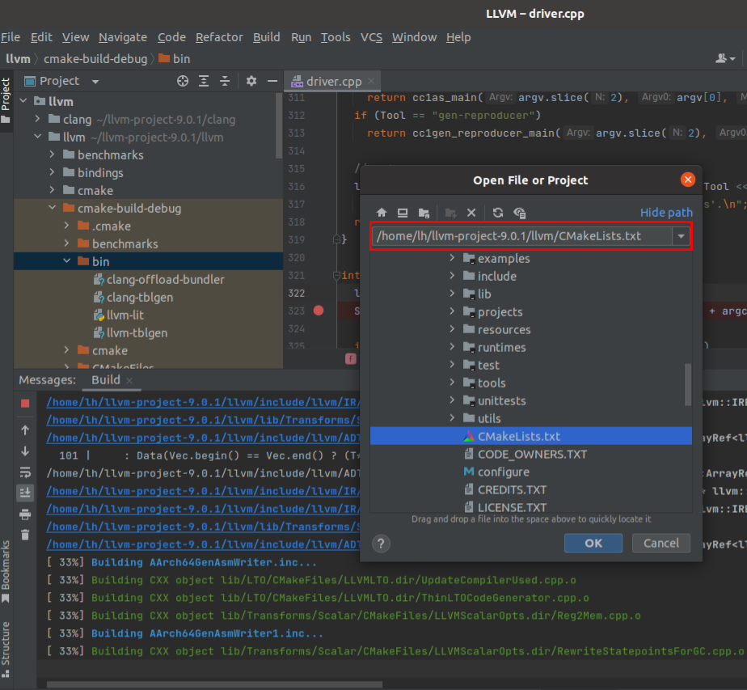
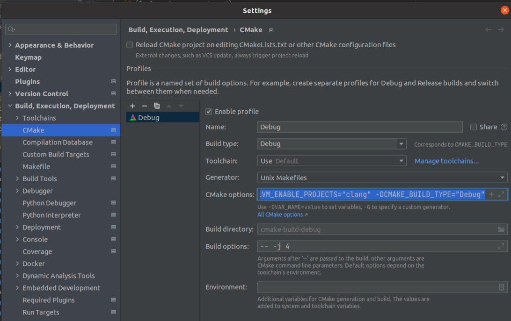

# LLVM编译方法

## 1.使用Ninja 编译

```
mkdir build_debug
cd build_debug
cmake -G Ninja ../llvm // 默认编译debug版本 但是不包含clang
//如果一开始没有编译clang的 可以在之后加上下面这句 然后 ninja clang 就可以 编译出clang
cmake -G Ninja  -DLLVM_INCLUDE_TESTS=OFF -DLLVM_ENABLE_PROJECTS="clang;" ../llvm 
// 编译clang的debug版本

cmake -G "Unix Makefiles" -DLLVM_ENABLE_PROJECTS="clang" -DCMAKE_BUILD_TYPE="Debug" ../llvm  //使用Unix Makefiles编译


```

```
mkdir build_release
cd build_release
cmake -G Ninja -DCMAKE_BUILD_TYPE=Release -DLLVM_INCLUDE_TESTS=OFF -DLLVM_ENABLE_PROJECTS="clang;" ../llvm // 编译release版本
```


## 2.使用clion编译方法



Setting->cmake



## 3.调试clang的方法

在clion中选择clang->tools=>drive=>driver.cpp 

项目选择clang|debug


/home/lh/keshi2/hello_clang.c -o /home/lh/keshi2/hello_clang_cloin 编译生成的配置路径


## 4.使用hello Pass

​	

```
opt -load LLVMHello.so  -enable-new-pm=0 -hello hello.bc  //这里可以将hello 替换成hello2 因为hello.cpp里面有两个pass 一个hello 一个hello2
```


## 5.Opt调试 hello Pass

在有debug版本的opt和libhellopass.so的前提下 使用 第四点 的命令 在opt,cpp的main 以及hello.cpp的模块下断点


## 6.终端运行opt hello pass

```
export PATH=/home/lh/llvm-project-9.0.1/llvm/cmake-build-debug/bin:$PATH
```

```
opt -load '/home/lh/llvm-project-9.0.1/llvm/cmake-build-debug/lib/LLVMHello.so' -hello '/home/lh/keshi2/hello_clang_encode.ll' 
```

## 7.创建一个自己的pass 利用clion


### 	1.在llvm=>lib=>Transforms下创建  EncodeFunctionName 目录

###     2.在EncodeFunctionName下创建CMakeLists.txt 和 EncodeFunctionName.cpp

### 	3.在EncodeFunctionName下创建CMakeLists.txt文件中添加如下编译规则

```
add_llvm_library(LLVMEncodeFunctionName2 MODULE BUILDTREE_ONLY
        EncodeFunctionName.cpp

        DEPENDS
        intrinsics_gen
        PLUGIN_TOOL
        opt
        )
```

### 	4.在Transforms目录下的CMakeLists.txt目录添加代码

​	

```
add_subdirectory(EncodeFunctionName)
```

### 	5.编写EncodeFunctionName.cpp的代码

​	

```c++
#include "llvm/Pass.h"
#include "llvm/IR/Function.h"
#include "llvm/Support/raw_ostream.h"
#include "llvm/IR/LegacyPassManager.h"
#include "llvm/Transforms/IPO/PassManagerBuilder.h"

using namespace llvm;

namespace {
struct EncodeFunctionName2 : public FunctionPass {
  static char ID;
  EncodeFunctionName2() : FunctionPass(ID) {}

  bool runOnFunction(Function &F) override {
    errs() << "EncodeFunctionName22: " << F.getName() << " -> ";
    if (F.getName().compare("main") != 0) {

      llvm::MD5 Hasher;
      llvm::MD5::MD5Result Hash;
      Hasher.update("kanxue_");
      Hasher.update(F.getName());
      Hasher.final(Hash);

      SmallString<32> HexString;
      llvm::MD5::stringifyResult(Hash, HexString);

      F.setName(HexString);
    }
    errs() << F.getName() << "\r\n";
    return false;
  }
};
}

char EncodeFunctionName2::ID = 0;

static RegisterPass<EncodeFunctionName2> X("encode2", "Encode Function Name Pass",
                                           false /* Only looks at CFG */,
                                           false /* Analysis Pass */);


namespace {
struct EncodeFunctionName : public FunctionPass {
  static char ID; // Pass identification, replacement for typeid
  EncodeFunctionName() : FunctionPass(ID) {}

  bool runOnFunction(Function &F) override {
    errs() << "Hello: ";
    errs().write_escaped(F.getName()) << '\n';
    return false;
  }

  // We don't modify the program, so we preserve all analyses.
  void getAnalysisUsage(AnalysisUsage &AU) const override {
    AU.setPreservesAll();
  }
};
}

char EncodeFunctionName::ID = 0;
static RegisterPass<EncodeFunctionName>
    Y("encode", "encode Pass (with getAnalysisUsage implemented)");


//
//static llvm::RegisterStandardPasses Y(
//    llvm::PassManagerBuilder::EP_EarlyAsPossible,
//[](const llvm::PassManagerBuilder &Builder,
//   llvm::legacy::PassManagerBase &PM) { PM.add(new EncodeFunctionName2()); });
```

### 	6.编译

​	如果是clion中则会自动同步我们编写的cmakeList.txt规则 如果不是,则需要 cmake -G Ninja ../llvm 同步一下

​	然后再执行一下命令

​	

```
cd cmake-build-debug
ninja LLVMEncodeFunctionName2 
```

 这里的LLVMEncodeFunctionName2 取决于cmakelists.txt目录下的MODULE的名称

结果如下图


### 7.使用pass

```
export PATH=/home/lh/llvm-project-9.0.1/llvm/cmake-build-debug/bin:$PATH
```

```
opt -load '/home/lh/llvm-project-9.0.1/llvm/cmake-build-debug/lib/LLVMEncodeFunctionName2.so'  -encode2 '/home/lh/keshi2/hello_clang.ll' -o /home/lh/keshi2/hello_clang_encode.bc 
```

这里的-encode2 取决于代码中 如下的 "Encode Function Name Pass"

```
static RegisterPass<EncodeFunctionName2> X("encode2", "Encode Function Name Pass",
                                           false /* Only looks at CFG */,
                                           false /* Analysis Pass */);
```

输出文件为 hello_clang_encode.bc 

### 8.输出结果


## 8.源码之外创建一个pass

### 1.创建和生成

​	在文件outpass内新建如下文件

​	

outPass文件的CMakeList.txt 如下

```cmake
cmake_minimum_required(VERSION 3.17)

project(outPass)

set(LLVM_DIR /home/lh/llvm-project-9.0.1/llvm/cmake-build-debug/lib/cmake/llvm/)
#修改成自己的llvm路径
find_package(LLVM REQUIRED CONFIG)

list(APPEND CMAKE_MODULE_PATH "${LLVM_CMAKE_DIR}")
include(AddLLVM)

add_definitions(${LLVM_DEFINITIONS})
include_directories(${LLVM_INCLUDE_DIRS})

add_subdirectory(EncodeFunctionName2)
```

EncodeFunctionName2内的CMakelist.txt如下

```cmake
add_llvm_library(LLVMEncodeFunctionName3 MODULE BUILDTREE_ONLY
        EncodeFunctionName3.cpp

        DEPENDS
        #intrinsics_gend
        #我屏蔽了这个 不知道这个的功能是什么 打开会报错
        PLUGIN_TOOL
        opt
        )
```

EncodeFunctionName3.cpp 内内容与上面EncodeFunctionName.cpp 一致

然后用Clion 


结果


### 2.使用

```linux
opt -load '/home/lh/keshi2/outPass/cmake-build-debug/EncodeFunctionName2/LLVMEncodeFunctionName3.so'   -encode2 '/home/lh/keshi2/hello_clang.ll' -o /home/lh/keshi2/hello_clang_encode.bc
```


```
clang -Xclang -load -Xclang /home/lh/keshi2/outPass/cmake-build-release/EncodeFunctionName2/LLVMEncodeFunctionName3.so   -encode3 /home/lh/keshi2/hello_clang.ll -o /home/lh/keshi2/hello_clang_encode.bc
```

使用后提示

```
clang-9: warning: argument unused during compilation: '-e ncode' [-Wunused-command-line-argument]
```

而且没有打印出 函数名称 以及md5之后的函数名称 但是已经生成了结果

## 9.将pass编译到clang中

### 1.在llvm=>include=>llvm=>Transform新建pass的头文件

在Transforms 下新建EncodeFunctionName文件夹 并在文件内创建 EncodeFunctionName.h文件

在 EncodeFunctionName.h 创建头文件

```c
//
// Created by lh on 22-7-9.
//

#ifndef LLVM_ENCODEFUNCTIONNAME_H
#define LLVM_ENCODEFUNCTIONNAME_H
#include "llvm/Pass.h"
//ianxie daima
namespace llvm{
  Pass * createEncodeFunctionName();
}

#endif // LLVM_ENCODEFUNCTIONNAME_H

```

在EncodeFunctionName.cpp 中实现 Pass * createEncodeFunctionName();

```c++
Pass * createEncodeFunctionName()
{
  new EncodeFunctionName2();
  
}
```

在llvm=>lib=>Transforms=>IPO=> PassManagerBuilder.cpp中添加注册

```c++
 //152行左右添加
cl::opt<bool> EnableEncodeFunctionName(
    "encode_function_name", cl::init(false), cl::Hidden,
    cl::desc("Eencode_function_name pass"));

//440行左右添加如下代码
    if(EnableEncodeFunctionName){
    MPM.add(createEncodeFunctionName());
  }
  //添加头文件
  #include "llvm/Transforms/EncodeFunctionName/EncodeFunctionName.h"
```

### 2.修改cmakelists.txt 将EncodeFunctionName修改成编译静态库

在llvm=>lib=>Transforms=>Sclar=>CMakeLists.txt 文件内抄一段代码

```cmake
ADDITIONAL_HEADER_DIRS
${LLVM_MAIN_INCLUDE_DIR}/llvm/Transforms
${LLVM_MAIN_INCLUDE_DIR}/llvm/Transforms/Scalar

DEPENDS
intrinsics_gen
```

添加到EncodeFuncName的文件内的CMakeLists.txt文件内 最终如下

修了后EncodeFunctionName 并不是一个module了

```
add_llvm_library(LLVMEncodeFunctionName2
        EncodeFunctionName.cpp

        ADDITIONAL_HEADER_DIRS
        ${LLVM_MAIN_INCLUDE_DIR}/llvm/Transforms
        ${LLVM_MAIN_INCLUDE_DIR}/llvm/Transforms/EncodeFunctionName

        DEPENDS
        intrinsics_gen
        )
```

修改LLVM=>lib=>Transforms=>LLVMBuild.txt

后面添加了一个 LLVMEncodeFunctionName2

```
[common]
subdirectories = AggressiveInstCombine Coroutines IPO InstCombine Instrumentation Scalar Utils Vectorize ObjCARC EncodeFunctionName2

[component_0]
type = Group
name = Transforms
parent = Libraries
```

修改LLVM=>lib=>Transforms=>IPO=>LLVMBuild.txt

```
[component_0]
type = Library
name = IPO
parent = Transforms
library_name = ipo
required_libraries = AggressiveInstCombine Analysis BitReader BitWriter Core InstCombine IRReader Linker Object ProfileData Scalar Support TransformUtils Vectorize Instrumentation EncodeFunctionName

```

### 3.编译

ninja LLVMEncodeFunctionName2


ninja clang 


### 4.执行


```
clang -mllvm -encode_function_name hello_clang.c
```


## 8.OLLVM 环境搭建

### 1.观察obfuscator-llvm-4.0 GitHub目录下修改的文件的

将obfuscator-llvm-4.0\lib\Transforms\Obfuscation 复制到llvm项目的llvm=>lib=>Transforms下

将obfuscator-llvm-4.0\include\llvm\Transforms\Obfuscation 复制到llvm=>include=>llvm=>Transforms=>

这个是obfuscator的头文件和cpp文件

删除 Obfuscation 文件下的makefile 


### 2.修改transforms目录下的cmakelists.txt LLVMBuild.txt

添加 add_subdirectory(Obfuscation)

LLVMBuild目录下添加 

```
subdirectories = AggressiveInstCombine Coroutines IPO InstCombine Instrumentation Scalar Utils Vectorize ObjCARC EncodeFunctionName Obfuscation
```

IPO下修改成

```
required_libraries = AggressiveInstCombine Analysis BitReader BitWriter Core InstCombine IRReader Linker Object ProfileData Scalar Support TransformUtils Vectorize Instrumentation EncodeFunctionName Obfuscation

```

### 3.修改PassManagerBuild.cpp

具体

```c++
 //populateModulePassManager 函数后面添加
  MPM.add(createSplitBasicBlock(Split));
  MPM.add(createBogus(BogusControlFlow));

  if(Flattening){
    MPM.add(createLowerSwitchPass());
  }

  MPM.add(createFlattening(Flattening));
  MPM.add(createSubstitution(Substitution));

```

```c++
#include "llvm/Transforms/Obfuscation/BogusControlFlow.h"
#include "llvm/Transforms/Obfuscation/Flattening.h"
#include "llvm/Transforms/Obfuscation/Split.h"
#include "llvm/Transforms/Obfuscation/Substitution.h"
#include "llvm/CryptoUtils.h"
//头文件添加
```

```c++
//164行左右添加
// Flags for obfuscation
static cl::opt<bool> Flattening("fla", cl::init(false),
                                cl::desc("Enable the flattening pass"));

static cl::opt<bool> BogusControlFlow("bcf", cl::init(false),
                                      cl::desc("Enable bogus control flow"));

static cl::opt<bool> Substitution("sub", cl::init(false),
                                  cl::desc("Enable instruction substitutions"));

static cl::opt<std::string> AesSeed("aesSeed", cl::init(""),
                                    cl::desc("seed for the AES-CTR PRNG"));

static cl::opt<bool> Split("split", cl::init(false),
                           cl::desc("Enable basic block splitting"));
```

### 4.处理报错


修改BogusControlFlow.cpp 531行 为    BranchInst * tbb= (BranchInst*)fi->getTerminator();

修改Flattening.cpp 


### 5.修改bug 
参考 https://github.com/obfuscator-llvm/obfuscator/pull/76/files 修改一些bug

### 6.编译 

ninja clang

### 7.使用OLLVM

#### 1.使用指令替换 sub 混淆

```
clang -mllvm -sub  hello_ollvm.c -o hello_ollvm_sub
```

```
clang -mllvm -sub -mllvm -sub_loop=3  hello_ollvm.c -o hello_ollvm_sub_3
```

#### 2.虚假控制流混淆bcf

```
clang -mllvm -bcf hello_ollvm_bcf.c -o hello_ollvm_bcf                  
clang -mllvm -bcf -mllvm -bcf_loop=3 hello_ollvm_bcf.c -o hello_ollvm_bcf_3
clang -mllvm -bcf -mllvm -bcf_loop=3 -mllvm -bcf_prob=40  hello_ollvm_bcf.c -o hello_ollvm_bcf_3_40
clang -mllvm -bcf -mllvm -bcf_loop=3 -mllvm -bcf_prob=80  hello_ollvm_bcf.c -o hello_ollvm_bcf_3_80
```

#### 3.控制流程平坦化( control flow flattening ) FLA

```
clang -mllvm -fla hello_ollvm_fla.c -o hello_ollvm_fla
clang -mllvm -fla -emit-llvm -S hello_ollvm_fla.c -o hello_ollvm_fla.ll
clang -mllvm -fla -mllvm -split hello_ollvm_fla.c -o hello_ollvm_fla_split
clang -mllvm -fla -mllvm -split -mllvm -split_num=3 hello_ollvm_fla.c -o hello_ollvm_fla_split_3
```

#### 4.函数属性

```
__attribute((__annotate__(("nofla"))))
__attribute((__annotate__(("nobcf"))))
__attribute((__annotate__(("nosub"))))
```

## 9.LLVM项目之外编译使用OLLVM

### 1.创建OLLVM文件 在文件内将上面使用OLLVM的代码按照路径复制过来


将所有CMakelist.txt以及LLVMBuild.txt文件内 除了与OLLVM相关的内容全部删除


要复制的内容 有

1.LLVM/include/目录下的与OLLVM相关的头文件 也可以将整个头文件全部复制过来 我试过也不会报错


2.OLLVM/lib/Transforms/Obfuscation/ 下的全部


3.依次每个路径下面的CMakelists.txt和LLVMBuild.txt文件

4.修改 /home/lh/keshi4/OLLVM/ollvm/lib/Transforms/Obfuscation 下的文件为如下内容 本来是编译成 xxx.a 修改为编译成xxx.so

```
add_llvm_library(LIUHANLLVMObfuscation MODULE
  CryptoUtils.cpp
  Substitution.cpp
  BogusControlFlow.cpp
  Utils.cpp
  SplitBasicBlocks.cpp
  Flattening.cpp
  )

add_dependencies(LLVMObfuscation intrinsics_gen)
```


### 2.注册OLLVM

Entry.cpp 在 Obfuscation内

```c++
//
// Created by lh on 22-7-16.
//

#include "llvm/Transforms/Obfuscation/BogusControlFlow.h"
#include "llvm/Transforms/Obfuscation/Flattening.h"
#include "llvm/Transforms/Obfuscation/Split.h"
#include "llvm/Transforms/Obfuscation/Substitution.h"
#include "llvm/Transforms/IPO//PassManagerBuilder.h"
#include "llvm/CryptoUtils.h"
#include "llvm/Transforms/Utils.h"
#include "llvm/IR/LegacyPassManager.h"

using namespace llvm;

// Flags for obfuscation
static cl::opt<bool> Flattening("fla", cl::init(false),
                                cl::desc("Enable the flattening pass"));

static cl::opt<bool> BogusControlFlow("bcf", cl::init(false),
                                      cl::desc("Enable bogus control flow"));

static cl::opt<bool> Substitution("sub", cl::init(false),
                                  cl::desc("Enable instruction substitutions"));

static cl::opt<std::string> AesSeed("aesSeed", cl::init(""),
                                    cl::desc("seed for the AES-CTR PRNG"));

static cl::opt<bool> Split("split", cl::init(false),
                           cl::desc("Enable basic block splitting"));


static llvm::RegisterStandardPasses Y(
    llvm::PassManagerBuilder::EP_EarlyAsPossible,
[](const llvm::PassManagerBuilder &Builder,
   llvm::legacy::PassManagerBase &PM) {

    if(!AesSeed.empty()) {
        if(!llvm::cryptoutils->prng_seed(AesSeed.c_str()))
            exit(1);
    }


    PM.add(createSplitBasicBlock(Split));
    PM.add(createBogus(BogusControlFlow));

    if(Flattening){
        printf("createLowerSwitchPass");
        PM.add(createLowerSwitchPass());
    }

    PM.add(createFlattening(Flattening));
    PM.add(createSubstitution(Substitution));

    });

```

3.运行&调试

```
Xclang -load -Xclang /home/lh/keshi4/OLLVM/cmake-build-debug/ollvm/lib/Transforms/Obfuscation/LIUHANLLVMObfuscation.so -mllvm -fla /home/lh/keshi3/hello_ollvm_fla.c -emit-llvm -S -o /home/lh/keshi3/hello_ollvm_fla_LiuhanOLLVM_11
```


## 10.NDK中使用OLLVM

1.将有OLLVM的release下面的bin include lib 文件复制到 /home/lh/android-ndk-r22/toolchains/llvm/prebuilt/linux-x86_64


2.在Android studio 的c++ 目录的CMakeLists.txt下修改为如下

```
add_definitions("-mllvm -fla -mllvm -split -mllvm -split_num=3")
```


